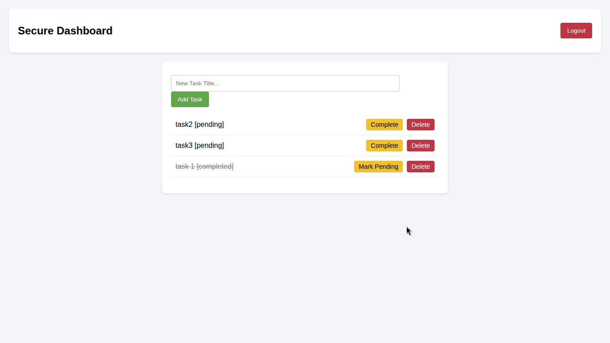

# PrimeTrade - Secure Backend API & Dashboard

> **Developed by:** [Chintu kumar] 
> **Email:** [chintukr1904@gmail.com]
> **GitHub:** [https://github.com/Chintukr2004]



A scalable RESTful API built with Go and PostgreSQL, featuring JWT-based authentication, role-based access control, and complete CRUD operations for task management. Includes a lightweight Vanilla JS frontend to interact with the API.

## Tech Stack
* **Backend:** Go (Golang 1.22+)
* **Database:** PostgreSQL
* **Authentication:** JWT (JSON Web Tokens) & Bcrypt Password Hashing
* **Frontend:** HTML/CSS & Vanilla JavaScript (Fetch API)

## Setup Instructions

### 1. Database Setup
Create a local PostgreSQL database named `intern_db` and execute the following SQL to create the tables:

```sql
CREATE TABLE users (
    id SERIAL PRIMARY KEY,
    email VARCHAR(255) UNIQUE NOT NULL,
    password_hash VARCHAR(255) NOT NULL,
    role VARCHAR(50) DEFAULT 'user',
    created_at TIMESTAMP DEFAULT CURRENT_TIMESTAMP
);

CREATE TABLE tasks (
    id SERIAL PRIMARY KEY,
    user_id INT REFERENCES users(id) ON DELETE CASCADE,
    title VARCHAR(255) NOT NULL,
    status VARCHAR(50) DEFAULT 'pending',
    created_at TIMESTAMP DEFAULT CURRENT_TIMESTAMP
);
2. Run the Backend Server
Ensure your PostgreSQL credentials in internal/database/db.go match your local environment. Then start the server:

Bash


go mod tidy
go run cmd/main.go
The backend will run on http://localhost:8080.

3. Run the Frontend
To avoid CORS issues when opening local files, serve the frontend folder using a simple HTTP server.

Bash


cd frontend
python3 -m http.server 3000
Visit http://localhost:3000 in your browser.

Scalability & Deployment Note
To transition this architecture into a highly scalable, production-ready environment, the following strategies would be implemented:

Microservices Architecture: As the application grows, the monolithic structure can be split. The Authentication service and the Task Management service can be decoupled into independent microservices communicating via gRPC or message queues (like RabbitMQ).

Caching (Redis): To reduce database load, a Redis caching layer should be introduced to cache frequently accessed data (e.g., retrieving the user's task list), invalidating the cache only upon PUT or DELETE operations.

Load Balancing: Deploying multiple instances of the Go backend behind a load balancer (like Nginx or AWS ALB) will distribute incoming traffic efficiently and prevent any single point of failure.

Containerization: The application and database should be Dockerized (Dockerfile and docker-compose.yml) to ensure consistent deployment environments and easy orchestration using Kubernetes.

4. Click the green **"Commit changes..."** button to save it.

### Step 2: Create the Postman File
1. Back on your main repository page, click the **"Add file"** button near the top and select **"Create new file"**.
2. Name the file exactly this: `Primetrade_API.postman_collection.json`
3. Paste the large JSON block I gave you earlier (the one that starts with `{ "info": { "name": "PrimeTrade API"...`) into this new file.
4. Click **"Commit changes..."**.

Once you do those two things, your repository will look incredibly professional, and your README will format perfectly with the image and clean instructions.
